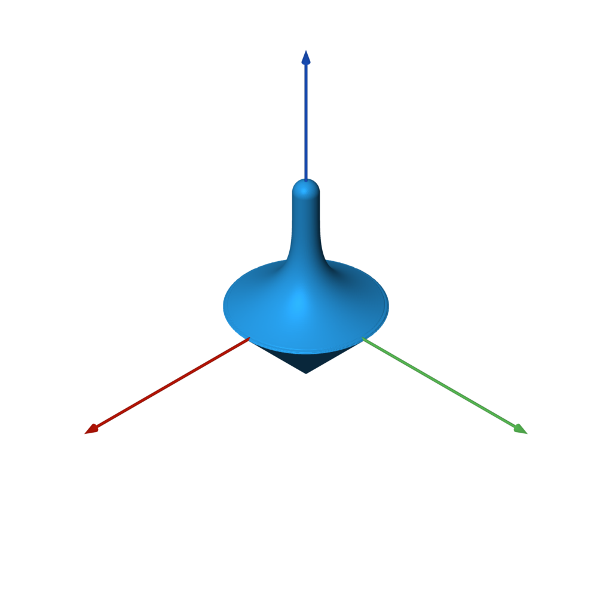
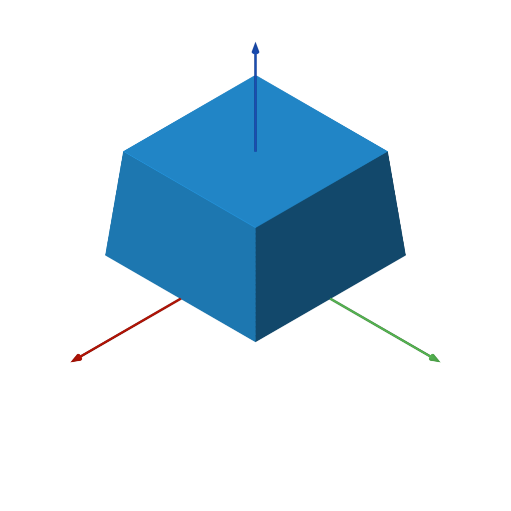
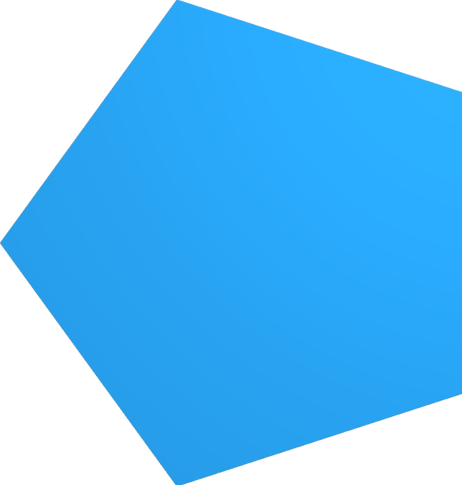
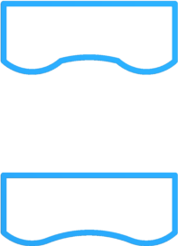
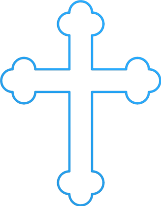

# sdf

Generate 3D meshes based on SDFs (signed distance functions) with a
dirt simple Python API.

Special thanks to [Inigo Quilez](https://iquilezles.org/) for his excellent documentation on signed distance functions:

- [3D Signed Distance Functions](https://iquilezles.org/www/articles/distfunctions/distfunctions.htm)
- [2D Signed Distance Functions](https://iquilezles.org/www/articles/distfunctions2d/distfunctions2d.htm)

## Example


Here is a complete example that generates the model shown. This is the
canonical [Constructive Solid Geometry](https://en.wikipedia.org/wiki/Constructive_solid_geometry)
example. Note the use of operators for union, intersection, and difference.

```python
from sdf import *

f = sphere(1) & box(1.5)

c = cylinder(0.5)
f -= c.orient(X) | c.orient(Y) | c.orient(Z)

f.save('out.stl')
```

Yes, that's really the entire code! You can 3D print that model or use it
in a 3D application.

## More Examples

Have a cool example? Submit a PR!

| [gearlike.py](examples/gearlike.py) | [knurling.py](examples/knurling.py) | [blobby.py](examples/blobby.py) | [weave.py](examples/weave.py) |
| --- | --- | --- | --- |
| | | | |
| | | | |

More examples!
| [pawn.py](examples/pawn.py) | [steering_wheel.py](examples/steering_wheel.py) | [spinning_top.py](examples/spinning_top.py) |
| --- | --- | --- |
| | | |

## Requirements

Note that the dependencies will be automatically installed by setup.py when
following the directions below.

- Python 3
- matplotlib
- meshio
- numpy
- Pillow
- scikit-image
- scipy

## Installation

Use the commands below to clone the repository and install the `sdf` library
in a Python virtualenv.

```bash
git clone https://github.com/fogleman/sdf.git
cd sdf
virtualenv env
. env/bin/activate
pip install -e .
```

Confirm that it works:

```bash
python examples/example.py # should generate a file named out.stl
```

You can skip the installation if you always run scripts that import `sdf`
from the root folder.

## File Formats

`sdf` natively writes binary STL files. For other formats, [meshio](https://github.com/nschloe/meshio)
is used (based on your output file extension). This adds support for over 20 different 3D file formats,
including OBJ, PLY, VTK, and many more.

## Viewing the Mesh


Find and install a 3D mesh viewer for your platform, such as [MeshLab](https://www.meshlab.net/).

I have developed and use my own cross-platform mesh viewer called [meshview](https://github.com/fogleman/meshview) (see screenshot).
Installation is easy if you have [Go](https://golang.org/) and [glfw](https://www.glfw.org/) installed:

```bash
$ brew install go glfw # on macOS with homebrew
$ go get -u github.com/fogleman/meshview/cmd/meshview
```

Then you can view any mesh from the command line with:

```bash
$ meshview your-mesh.stl
```

See the meshview [README](https://github.com/fogleman/meshview) for more complete installation instructions.

On macOS you can just use the built-in Quick Look (press spacebar after selecting the STL file in Finder) in a pinch.

# API

In all of the below examples, `f` is any 3D SDF, such as:

```python
f = sphere()
```

## Bounds

The bounding box of the SDF is automatically estimated. Inexact SDFs such as
non-uniform scaling may cause issues with this process. In that case you can
specify the bounds to sample manually:

```python
f.save('out.stl', bounds=((-1, -1, -1), (1, 1, 1)))
```

## Resolution

The resolution of the mesh is also computed automatically. There are two ways
to specify the resolution. You can set the resolution directly with `step`:

```python
f.save('out.stl', step=0.01)
f.save('out.stl', step=(0.01, 0.02, 0.03)) # non-uniform resolution
```

Or you can specify approximately how many points to sample:

```python
f.save('out.stl', samples=2**24) # sample about 16M points
```

By default, `samples=2**22` is used.

*Tip*: Use the default resolution while developing your SDF. Then when you're done,
crank up the resolution for your final output.

## Fast Quadric Mesh Simplification

Simplification of the mesh can be accomplished at the same time by using:

```python
f.save('out.stl', samples=2**24, simplify=True)
# to simplify (remove 80%) of the mesh after rendering, use:
f.save('out.stl', samples=2**24, simplify=True, simp_ratio=0.2)
# to change the simplification agressive value use
f.save('out.stl', samples=2**24, simplify=True, simp_agressive=5)
```

or generate once and then simplify afterwards:

```python
points = f.generate()
points = simplify(points)
save_mesh("test_output.stl",points)  # save as STL file
#save_mesh("test_output.stp",points)  # save as STEP file
```

By default, `simp_ratio=0.5, simp_agressive=7` is used.

For more information see https://github.com/sp4cerat/Fast-Quadric-Mesh-Simplification


## Batches

The SDF is sampled in batches. By default the batches have `32**3 = 32768`
points each. This batch size can be overridden:

```python
f.save('out.stl', batch_size=64) # instead of 32
```

The code attempts to skip any batches that are far away from the surface of
the mesh. Inexact SDFs such as non-uniform scaling may cause issues with this
process, resulting in holes in the output mesh (where batches were skipped when
they shouldn't have been). To avoid this, you can disable sparse sampling:

```python
f.save('out.stl', sparse=False) # force all batches to be completely sampled
```

## Worker Threads

The SDF is sampled in batches using worker threads. By default,
`multiprocessing.cpu_count()` worker threads are used. This can be overridden:

```python
f.save('out.stl', workers=1) # only use one worker thread
```

## Without Saving

You can of course generate a mesh without writing it to an STL file:

```python
points = f.generate() # takes the same optional arguments as `save`
print(len(points)) # print number of points (3x the number of triangles)
print(points[:3]) # print the vertices of the first triangle
```

If you want to save an STL after `generate`, just use:

```python
write_binary_stl(path, points)
```

## Reading and Saving Mesh Files

To read the points from a mesh file use `read_mesh(file)` and to save use `save_mesh(file, points)`.
The format of the file is determined by the suffix.  For a full list of supported formats, refer to
meshio.  The additonal STEP file format is only available for saving.

An example of reading a STL file, simplifying it, and then writing it out as a STEP file:

```python
points = read_mesh("my_mesh.stl")  # This reads a STL file
points = simplify(points)          # Reduce the mesh to about half
save_mesh("my_mesh.stp",points)    # Write the mesh out to a STEP file
```

## Visualizing the SDF


You can plot a visualization of a 2D slice of the SDF using matplotlib.
This can be useful for debugging purposes.

```python
f.show_slice(z=0)
f.show_slice(z=0, abs=True) # show abs(f)
```

You can specify a slice plane at any X, Y, or Z coordinate. You can
also specify the bounds to plot.

Note that `matplotlib` is only imported if this function is called, so it
isn't strictly required as a dependency.

<br clear="right">

## How it Works

The code simply uses the [Marching Cubes](https://en.wikipedia.org/wiki/Marching_cubes)
algorithm to generate a mesh from the [Signed Distance Function](https://en.wikipedia.org/wiki/Signed_distance_function).

This would normally be abysmally slow in Python. However, numpy is used to
evaluate the SDF on entire batches of points simultaneously. Furthermore,
multiple threads are used to process batches in parallel. The result is
surprisingly fast (for marching cubes). Meshes of adequate detail can
still be quite large in terms of number of triangles.

The core "engine" of the `sdf` library is very small and can be found in
[mesh.py](sdf/mesh.py).

In short, there is nothing algorithmically revolutionary here. The goal is
to provide a simple, fun, and easy-to-use API for generating 3D models in our
favorite language Python.

## Files

- [sdf/d2.py](sdf/d2.py): 2D signed distance functions
- [sdf/d3.py](sdf/d3.py): 3D signed distance functions
- [sdf/dn.py](sdf/dn.py): Dimension-agnostic signed distance functions
- [sdf/ease.py](sdf/ease.py): [Easing functions](https://easings.net/) that operate on numpy arrays. Some SDFs take an easing function as a parameter.
- [sdf/mesh.py](sdf/mesh.py): The core mesh-generation engine. Also includes code for estimating the bounding box of an SDF and for plotting a 2D slice of an SDF with matplotlib.
- [sdf/progress.py](sdf/progress.py): A console progress bar.
- [sdf/stl.py](sdf/stl.py): Code for writing a binary [STL file](https://en.wikipedia.org/wiki/STL_(file_format)).
- [sdf/text.py](sdf/text.py): Generate 2D SDFs for text (which can then be extruded)
- [sdf/util.py](sdf/util.py): Utility constants and functions.

## SDF Implementation

It is reasonable to write your own SDFs beyond those provided by the
built-in library. Browse the SDF implementations to understand how they are
implemented. Here are some simple examples:

```python
@sdf3
def sphere(radius=1, center=ORIGIN):
    def f(p):
        return np.linalg.norm(p - center, axis=1) - radius
    return f
```

An SDF is simply a function that takes a numpy array of points with shape `(N, 3)`
for 3D SDFs or shape `(N, 2)` for 2D SDFs and returns the signed distance for each
of those points as an array of shape `(N, 1)`. They are wrapped with the
`@sdf3` decorator (or `@sdf2` for 2D SDFs) which make boolean operators work,
add the `save` method, add the operators like `translate`, etc.

```python
@op3
def translate(other, offset):
    def f(p):
        return other(p - offset)
    return f
```

An SDF that operates on another SDF (like the above `translate`) should use
the `@op3` decorator instead. This will register the function such that SDFs
can be chained together like:

```python
f = sphere(1).translate((1, 2, 3))
```

Instead of what would otherwise be required:

```python
f = translate(sphere(1), (1, 2, 3))
```

## Remember, it's Python!


Remember, this is Python, so it's fully programmable. You can and should split up your
model into parameterized sub-components, for example. You can use for loops and
conditionals wherever applicable. The sky is the limit!

See the [customizable box example](examples/customizable_box.py) for some starting ideas.

<br clear="right">

# Function Reference

## 3D Primitives

### sphere

Draw a sphere with the radius centered around `center`, by default this is the origin (0,0,0).


`sphere(radius=1, center=ORIGIN)`

```python
f = sphere() # unit sphere
f = sphere(2) # specify radius
f = sphere(1, (1, 2, 3)) # translated sphere
```

### box

Draw a 3D box with sides specified centered around `center`, by default this is the origin (0,0,0).


`box(size=1, center=ORIGIN, a=None, b=None)`

```python
f = box(1) # all side lengths = 1, like a cube
f = box((1, 2, 3)) # different side lengths
f = box(a=(-1, -1, -1), b=(3, 4, 5)) # specified by bounds
```

### rounded_box


Draw a 3D rounded box with sides specified centered around `center`, by default this is the origin (0,0,0).  The radius of curvature is specified by `radius`.

`rounded_box(size, radius, center=ORIGIN)`

```python
f = rounded_box((1, 2, 3), 0.25)
```

### wireframe_box


Draw a 3D box with round wires (diameter is specified by thickness) and centered around `center`, by default this is the origin (0,0,0).  The radius of curvature is specified by `radius`.

`wireframe_box(size, thickness)`

```python
f = wireframe_box((1, 2, 3), 0.05)
```

### torus


torus is like a doughnut shape, like a circle with radius, `r2`, rotated around the `Z` axis at a radius, `r1`, from the center.

`torus(r1, r2)`

```python
f = torus(1, 0.25)
```

### capsule


capsule is a cylinder with rounded ends extending from `-Z` to `Z` and having the radius, `radius`.

`capsule(a, b, radius)`

```python
f = capsule(-Z, Z, 0.5)
```

### capped_cylinder


capped_cylinder is a flat ended cylinder extending from `a` to `b`, both 3D vectors, and having the radius, `radius`.

`capped_cylinder(a, b, radius)`

```python
# note: Z = np.array((0, 0, 1))
f = capped_cylinder(-Z, Z, 0.5)
```

### rounded_cylinder


rounded_cylinder is a flat ended cylinder with curved edges extending from `a` to `b`, scalers along the Z axis, and having the radius, `ra`, and the edges having a radius of `rb`.

`rounded_cylinder(ra, rb, h)`

```python
f = rounded_cylinder(0.5, 0.1, 2)
```

### capped_cone


capped_cone is a flat ended cone extending from `a` to `b`, both 3D vectors, and having the radii, `ra` and `rb`.

`capped_cone(a, b, ra, rb)`

```python
# note: Z = np.array((0, 0, 1))
f = capped_cone(-Z, Z, 1, 0.5)
```

### rounded_cone


rounded_cone is a hemisphere ended cone extending along the Z axis from 0 to `h`, and having the radii, `r1` and `r2`.

`rounded_cone(r1, r2, h)`

```python
f = rounded_cone(0.75, 0.25, 2)
```

### ellipsoid


ellipsoid is like a distored sphere centered at the origin, size is specified by a 3D array of scalars.

`ellipsoid(size)`

```python
f = ellipsoid((1, 2, 3))
```

### pyramid


pyramid is the simplest 3D flat sided object, consisting of one side being a
triangle at the base and 3 more equal sized triangles matching those edges and
meeting at the point `h` along the `Z` axis.

`pyramid(h)`

```python
f = pyramid(1)
```

## Platonic Solids

### tetrahedron


`tetrahedron(r)`

```python
f = tetrahedron(1)
```

### octahedron


`octahedron(r)`

```python
f = octahedron(1)
```

### dodecahedron


`dodecahedron(r)`

```python
f = dodecahedron(1)
```

### icosahedron


`icosahedron(r)`

```python
f = icosahedron(1)
```

## Infinite 2D Primitives

The following SDFs extend to infinity in some or all axes.  They can only
effectively be used in combination with other shapes, as shown in the examples
below.

### line


`line(normal=UP, point=ORIGIN)`

`line` is an infinite cut line, with the positive side being inside and the
negative side being outside.

```python
f = (circle() & line()).extrude(0.1)
```

### crop


`crop(x0=None, y0=None, x1=None, y1=None, k=None)`

`crop` is useful for cutting a shape on one or more axis-aligned planes.  Note
that one can accomplish the same affect by four line cuts with axis normals and
points defined on the edges.

```python
f = (circle() & crop(y0=-0.5, y1=0.5, x0=0)).extrude(0.1)
```


## Infinite 3D Primitives

The following SDFs extend to infinity in some or all axes.  They can only
effectively be used in combination with other shapes, as shown in the examples
below.

### plane


`plane(normal=UP, point=ORIGIN)`

`plane` is an infinite plane, with the positive side being inside and the
negative side being outside.

```python
f = sphere() & plane()
```

### slab


`slab(x0=None, y0=None, z0=None, x1=None, y1=None, z1=None, k=None)`

`slab` is useful for cutting a shape on one or more axis-aligned planes.  Note
that the same effect can be accomplished by using multiple planes cutting with
a normal starting at points on the cut plane.

```python
f = sphere() & slab(z0=-0.5, z1=0.5, x0=0)
```

### cylinder


`cylinder(radius)`

`cylinder` is an infinite cylinder along the Z axis.  This is useful for
cutting a hole in an object (- operation) or widdling down an object
so it fits within a cylinder (& operation).

```python
f = sphere() - cylinder(0.5)
```

## Text

<p align="center"></p>

Yes, even text is supported!

`text(font_name, text, width=None, height=None, pixels=PIXELS, points=512)`

```python
FONT = 'Arial'
TEXT = 'Hello, world!'

w, h = measure_text(FONT, TEXT)

f = rounded_box((w + 1, h + 1, 0.2), 0.1)
f -= text(FONT, TEXT).extrude(0.2).k(0.05)
```

Note: [PIL.ImageFont](https://pillow.readthedocs.io/en/stable/reference/ImageFont.html),
which is used to load fonts, does not search for the font by name on all operating systems.
For example, on Ubuntu the full path to the font has to be provided.
(e.g. `/usr/share/fonts/truetype/freefont/FreeMono.ttf`)

## Images

Image masks can be extruded and incorporated into your 3D model.


`image(path_or_array, width=None, height=None, pixels=PIXELS)`

```python
IMAGE = 'examples/butterfly.png'

w, h = measure_image(IMAGE)

f = rounded_box((w * 1.1, h * 1.1, 0.1), 0.05)
f |= image(IMAGE).extrude(1) & slab(z0=0, z1=0.075)
```

## Positioning

### translate


`translate(other, offset)`

```python
f = sphere().translate((0, 0, 2))
```

### scale


Scale and figure larger or smaller with `factor`.  Unity, 1.0, will leave the
object the same and smaller numbers will shrink, such as 0.5 which scales to
half the size, and 2.0 which scales to double the size.

`scale(other, factor)`

Note that non-uniform scaling is an inexact SDF.

```python
f = sphere().scale(2)
f = sphere().scale((1, 2, 3)) # non-uniform scaling
```

### rotate and rotateD


Given an angle and rotation vector, rotate the figure by `angle` in radians
(for rotate) or degrees (for rotateD), around the vector axis.  So a rotation
around Z will translate points around the X-Y plane and leave the Z values the
same.

`rotate(other, angle, vector=Z)`
`rotateD(other, angle_in_degrees, vector=Z)`

```python
f = capped_cylinder(-Z, Z, 0.5).rotate(pi / 4, X)
f = capped_cylinder(-Z, Z, 0.5).rotateD(45, X)
```

### mirror


This function reflects the 3d image over the plane specified by the vector.
For example, using `Z` will reflect across the `Z` plane mapping every positive
`Z` point to it's negative counterpart and vice versa.

`mirror(other, vector, center=ORIGIN)`

```python
f = circle(3).taper_extrude(3,1).translate((0,0,-3))
# draw it again upside down
f |= circle(3).taper_extrude(3,1).translate((0,0,-3)).mirror([0,0,1])
```

### mirror_copy


`mirror_copy(other, vector, center=ORIGIN)`

```python
f = circle(3).taper_extrude(3,1).translate((0,0,-3)).mirror_copy([0,0,1])
```

### orient


`orient(other, axis)`

`orient` rotates the shape such that whatever was pointing in the +Z direction
is now pointing in the specified direction.

```python
c = capped_cylinder(-Z, Z, 0.25)
f = c.orient(X) | c.orient(Y) | c.orient(Z)
```

## Boolean Operations

The following primitives `a` and `b` are used in all of the following
boolean operations.

```python
a = box((3, 3, 0.5))
b = sphere()
```

The named versions (`union`, `difference`, `intersection`) can all take
one or more SDFs as input. They all take an optional `k` parameter to define the amount
of smoothing to apply. When using operators (`|`, `-`, `&`) the smoothing can
still be applied via the `.k(...)` function.

### union


```python
f = a | b
f = union(a, b) # equivalent
```

<br clear="right">

### difference


```python
f = a - b
f = difference(a, b) # equivalent
```

<br clear="right">

### intersection


```python
f = a & b
f = intersection(a, b) # equivalent
```

<br clear="right">

### smooth_union


```python
f = a | b.k(0.25)
f = union(a, b, k=0.25) # equivalent
```

<br clear="right">

### smooth_difference


```python
f = a - b.k(0.25)
f = difference(a, b, k=0.25) # equivalent
```

<br clear="right">

### smooth_intersection


```python
f = a & b.k(0.25)
f = intersection(a, b, k=0.25) # equivalent
```

<br clear="right">

## Repetition

### repeat


`repeat(other, spacing, count=None, padding=0)`

`repeat` can repeat the underlying SDF infinitely or a finite number of times.
If finite, the number of repetitions must be odd, because the count specifies
the number of copies to make on each side of the origin. If the repeated
elements overlap or come close together, you may need to specify a `padding`
greater than zero to compute a correct SDF.

```python
f = sphere().repeat(3, (1, 1, 0))
```

### circular_array


`circular_array(other, count, offset)`

`circular_array` makes `count` copies of the underlying SDF, arranged in a
circle around the Z axis. `offset` specifies how far to translate the shape
in X before arraying it. The underlying SDF is only evaluated twice (instead
of `count` times), so this is more performant than instantiating `count` copies
of a shape.

```python
f = capped_cylinder(-Z, Z, 0.5).circular_array(8, 4)
```

## Miscellaneous


Some of the functions demonstrated below use an example as a starting point:

```python
f = sphere(1) & box(1.5)
c = cylinder(0.5)
f -= c.orient(X) | c.orient(Y) | c.orient(Z)
example = f
```

### blend


Blending of two objects using the scalar distance function between values of two objects with scalar k.

`blend(a, *bs, k=0.5)`

```python
f = sphere().blend(box())
```

### dilate


Decrease the scalar distance value by radius, `r`, making the object edges dilate, or appear to inflate.

`dilate(other, r)`

```python
f = example.dilate(0.1)
```

### erode


Increase the scalar distance value by radius, `r`, making the object edges erode, or appear to deflate.

`erode(other, r)`

```python
f = example.erode(0.1)
```

### shell


Create a shell at every boundary, where the scalar distance value crosses positive and negative values.  The thickness of the shell created on the edge is defined by `thickness`.

`shell(other, thickness)`

```python
f = sphere().shell(0.05) & plane(-Z)
```

### elongate


`elongate(other, size)`

```python
f = example.elongate((0.25, 0.5, 0.75))
```

### twist


`twist(other, k)`

```python
f = box().twist(pi / 2)
```

### bend


`bend(other, k)`

```python
f = box().bend(1)
```

### bend_linear


`bend_linear(other, p0, p1, v, e=ease.linear)`

```python
f = capsule(-Z * 2, Z * 2, 0.25).bend_linear(-Z, Z, X, ease.in_out_quad)
```

### bend_radial


`bend_radial(other, r0, r1, dz, e=ease.linear)`

```python
f = box((5, 5, 0.25)).bend_radial(1, 2, -1, ease.in_out_quad)
```

### transition_linear


`transition_linear(f0, f1, p0=-Z, p1=Z, e=ease.linear)`

```python
f = box().transition_linear(sphere(), e=ease.in_out_quad)
```

### transition_radial


`transition_radial(f0, f1, r0=0, r1=1, e=ease.linear)`

```python
f = box().transition_radial(sphere(), e=ease.in_out_quad)
```

### wrap_around


This function will take an XYZ cartesian coordinate space and convert into
polar coordinates where the X axis is mapped into the radial axis, Y axis into
the angular, and Z is left alone.

`wrap_around(other, x0, x1, r=None, e=ease.linear)`

```python
FONT = 'Arial'
TEXT = ' wrap_around ' * 3
w, h = measure_text(FONT, TEXT)
f = text(FONT, TEXT).extrude(0.1).orient(Y).wrap_around(-w / 2, w / 2)
```

## 2D to 3D Operations

### extrude


`extrude(other, h)`

```python
f = hexagon(1).extrude(1)
```

### rounded_extrude


Extrude a 2D and add round edges on border.

`rounded_extrude(other, h, radius=0)`

```python
f = hexagon(10).rounded_extrude(5, radius=2)
```


Note: when using a negative value, the rounding will go in the opposite direction.

```python
f = hexagon(10).rounded_extrude(5, radius=-2)
```

### rounded_extrude_stack


Extrude two 2D images and add round edges on border and at the intersection weld the joints.

`rounded_extrude_stack(other_bottom, other_top, height_bottom, height_top, radius)`

To increase tensile strength, sometimes it is useful to add more material at
joints, so increasing the weld_radius will add more fill.

`rounded_extrude_stack(other_bottom, other_top, height_bottom, height_top, radius, weld_radius)`

```python
f = rounded_extrude_stack(rectangle([16,6]),rectangle([6,16]), 5, 7, radius=1)
# to alter the weld radius between the two objects:
f = rounded_extrude_stack(rectangle([16,6]),rectangle([6,16]), 5, 7, radius=1, weld_radius=2):
```

### extrude_to


`extrude_to` takes two different 2D objects and blends them together by an ease
operator, by default it is linear, so as to make a smooth transition between
the two objects.

`extrude_to(a, b, h, e=ease.linear)`

```python
f = rectangle(2).extrude_to(circle(1), 2, ease.in_out_quad)
```

### taper_extrude



In `taper_extrude`, slope is the amount of contracting per unit Z over the
height of the extrude.  A negative value will cause the image to expand and
corners will become a larger rounded edge.

`taper_extrude(other, height, slope=0, e=ease.linear)`

```python
f = rectangle(10).taper_extrude(6, slope=0.1)
```


### revolve


`revolve` takes a 2D object and rotates it around the `Z` axis.  Offset is how
far the center point is moved away from the origin on the `XY` plane.

`revolve(other, offset=0)`

```python
f = hexagon(1).revolve(3)
```

### helix_revolve


`helix_revolve` will take a 2D object and rotate it around the `Z` axis while
linearly moving in a helix toward positive `Z`.  A practical use for this is to
create threads.  By negating pitch, one can reverse the thread, changing the
rotation from right-handed to left-handed.

`helix_revolve(other, offset=0, pitch=1, rotations=1)`

```python
f = polygon([[3,0],[4,.5],[4,1],[3,1.5]]).helix_revolve(pitch=2, rotations=4.3)
```

## 3D to 2D Operations

### slice


`slice(other)`

```python
f = example.translate((0, 0, 0.55)).slice().extrude(0.1)
```

## 2D Primitives

Note: The examples 2D functions below are called and then extruded to show how
to convert a 2D to a 3D.

### circle


`circle(radius=1, center=ORIGIN)`

```python
f = circle(2).extrude(0.1)
```

### rectangle


`rectangle(size=1, center=ORIGIN, a=None, b=None)`

```python
f = rectangle([2,1]).extrude(0.1)
# or you can specify the corners:
f = rectangle(a=[-2,-1],b=[2,1]).extrude(0.1)
```

### rounded_rectangle


`rounded_rectangle(size=1, radius=0.1, center=ORIGIN, a=None, b=None)`

```python
f = rounded_rectangle([2,1],0.2).extrude(0.1)
# or you can specify the corners:
f = rectangle(a=[-2,-1],b=[2,1],radius=0.2).extrude(0.1)
```

### equilateral_triangle


`equilateral_triangle(r, center=ORIGIN)`

```python
f = equilateral_triangle(3).extrude(0.1)
```

### hexagon


`hexagon(r)`

```python
f = hexagon(2).extrude(0.1)
```

### equilateral_polygon



`equilateral_polygon(n, r)`

`equilateral_polygon` makes a shape with equal sides, for example `n=3` is a
triangle, `n=4` is square, `n=5` is a pentagon, and so forth.  Note: The right edge
will always be vertical and the radius is the distance to the center of a flat face.

```python
f = equilateral_polygon(5,10).extrude(0.1)
```

### rounded_x


`rounded_x(w, r)`

```python
f = rounded_x(10,2).extrude(0.1)
```

### rounded_cog


`rounded_cog(outer_r, cog_r, num)`

```python
f = rounded_cog(38, 6, 14).extrude(0.1)
```

### polygon


`polygon(points)`

```python
f = polygon([[-16,-16],[14,-8],[3,4],[0,12]]).extrude(0.1)
```

### rounded_polygon


The points provided to the curve polygon are in the form of [x,y,curve_radius] where a
curve_radius value of negative will create an arc in the left hand rotation and
positive in the right hand rotation.  A curve_radius of 0 implies a straight line.

`rounded_polygon(points_with_curve)`

```python
f = rounded_polygon([[-2,0,0],[0,2,-2**0.5],[2,0,-2**0.5],[0,-2,0]]).extrude(0.1)
```

## Rounded Polygon Operations

### round_polygon_corners


This function will change 
When matching three curves, concave-convex-concave or convex-concave-convex, this function
will move the points along the outer curves in order to match the center curve exactly.

`round_polygon_corners(points_with_curve, radius)`
`round_polygon_corners(points_with_curve, [radii...], [index_of_vertex...])`

```python
pts1 = [[10,0,0],[1,1,-20],[3,10,0]]
pts2 = [[-10,0,0],[-1,1,20],[-3,10,0]]
pts3 = [[10,-10,0],[1,-9,-18],[3,0,20]]
pts4 = [[-10,-10,0],[-1,-9,-18],[-3,0,20]]
f = rounded_polygon(pts1).shell(0.1).extrude(0.1)
f |= rounded_polygon(pts2).shell(0.1).extrude(0.1)
f |= rounded_polygon(pts3).shell(0.1).extrude(0.1)
f |= rounded_polygon(pts4).shell(0.1).extrude(0.1)
rpts1 = round_polygon_corners(pts1,1)
rpts2 = round_polygon_corners(pts2,1)
rpts3 = round_polygon_corners(pts3,1)
rpts4 = round_polygon_corners(pts4,1)
f |= rounded_polygon(rpts1).extrude(0.1)
f |= rounded_polygon(rpts2).extrude(0.1)
f |= rounded_polygon(rpts3).extrude(0.1)
f |= rounded_polygon(rpts4).extrude(0.1)
```

### round_polygon_smooth_ends



When matching three curves, concave-convex-concave or convex-concave-convex, this function
will move the points along the outer curves in order to match the center curve exactly.

`round_polygon_smooth_ends(index_of_side_to_modify)`

```python
pts = [[3,0,0],[2,0,-0.75],[1,0,2],[0,0,-0.75],[0,1,0],[3,1,0]]
f = rounded_polygon(pts).translate((0,3)).shell(0.1).extrude(0.1)
rpts = round_polygon_smooth_ends(pts,[1])
f |= rounded_polygon(rpts).shell(0.1).extrude(0.1)
```

## 2D Operations

### edge



`edge(width)`

```python

f = rounded_polygon([
   [-4,-1,0],[-6,-1,-1],[-6,1,-1],  [-4,1,-1], [-1,1,0],  # Left
   [-1,4,0], [-1,6,-1], [1,6,-1],   [1,4,-1],  [1,1,0],   # Top
   [4,1,0],  [6,1,-1],  [6,-1,-1],  [4,-1,-1], [1,-1,0],  # Right
   [1,-8,0], [1,-10,-1],[-1,-10,-1],[-1,-8,-1],[-1,-1,0]  # Bottom
   ]).edge(0.1).extrude(0.1)
```

### mirror


`mirror(other, axis=Y, center=ORIGIN)`

```
s = circle(2).translate((3,3))
# draw another on the side, mirrored over the negative X
s |= circle(2).translate((3,3)).mirror([1,0])
f = s.extrude(0.1)
```

### mirror_copy


`mirror_copy(other, axis=Y, center=ORIGIN)`

```python
s = circle(2).translate((3,3)).mirror_copy([1, 0.1])
f = s.extrude(0.1)
```

## Math Functions

Standard math routines provided by Python are available, and additional functions available are:

### Trigonometric
`arc_sinD(slope)`
`arc_cosD(slope)`
`arc_tanD(slope)`
`arc_tan2D(y,x)`

Returns an angle in degrees.

`sinD(ang)`
`cosD(ang)`
`tanD(ang)`

Takes degrees and returns the trigonometric value.

## Building GCODE output

To make GCODE files, one needs to choose between which method to print, either additive method (such as plastic printing) or subtractive (such as CNC milling).  These two interfaces rely on external packages, in particular slic3r and pycam.  To call them, use the following functions:

```python
f = sphere(1)
points = f.generate(samples=None,step=resolution,batch_size=48, simplify=True, simp_agressive=7,simp_ratio=0.1)
```

The two methods below use the existing python code for generating a figure.

### Slic3r

```python
# Write out gcode for this object for additive manufacturing
# Usage and details can be found https://manual.slic3r.org/
slic3r("steeringwheel.gcode",points,options={'layer-height': 0.2})

#slic3r("steeringwheel.gcode",points,options={
#  'layer-height': 0.2,
#  'nozzle-diameter': 0.35,
#  'filament-diameter': 2.85,
#  'temperature': 185,
#  'first-layer-temperature': 195,
#  'layer-height': 0.2,
#  })
```

### PyCAM

```python
# Write out gcode for this object for cnc manufacturing
pycam("pycnc_steeringwheel_rough.yaml",points)
```

an example yaml file is provided in the pycam project here:

https://raw.githubusercontent.com/eddeliu/pycam-1/master/yaml_flow_example.yml
