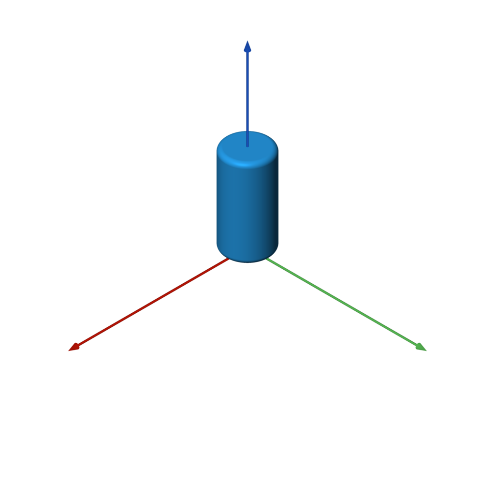

# sdf

Generate 3D meshes based on SDFs (signed distance functions) with a
dirt simple Python API.

Special thanks to [Inigo Quilez](https://iquilezles.org/) for his excellent documentation on signed distance functions:

- [3D Signed Distance Functions](https://iquilezles.org/www/articles/distfunctions/distfunctions.htm)
- [2D Signed Distance Functions](https://iquilezles.org/www/articles/distfunctions2d/distfunctions2d.htm)

## Example


Here is a complete example that generates the model shown. This is the
canonical [Constructive Solid Geometry](https://en.wikipedia.org/wiki/Constructive_solid_geometry)
example. Note the use of operators for union, intersection, and difference.

```python
from sdf import *

f = sphere(1) & box(1.5)

c = cylinder(0.5)
f -= c.orient(X) | c.orient(Y) | c.orient(Z)

f.save('out.stl')
```

Yes, that's really the entire code! You can 3D print that model or use it
in a 3D application.

## More Examples

| [gearlike.py](examples/gearlike.py) | [knurling.py](examples/knurling.py) | [blobby.py](examples/blobby.py) | [weave.py](examples/weave.py) |
| --- | --- | --- | --- |
|  |  |  |  |

## Requirements

Note that the dependencies will be automatically installed by setup.py when
following the directions below.

- Python 3
- numpy
- scikit-image

## Installation

Use the commands below to clone the repository and install the `sdf` library
in a Python virtualenv.

```bash
git clone https://github.com/fogleman/sdf.git
cd sdf
virtualenv env
. env/bin/activate
pip install -e .
```

Confirm that it works:

```bash
python examples/example.py # should generate a file named out.stl
```

You can skip the installation if you always run scripts that import `sdf`
from the root folder.

## Bounds

The bounding box of the SDF is automatically estimated. Inexact SDFs such as
non-uniform scaling may cause issues with this process. In that case you can
specify the bounds manually:

```python
f.save('out.stl', bounds=((-1, -1, -1), (1, 1, 1)))
```

## Resolution

The resolution of the mesh is also handled automatically. There are two ways
to specify the resolution. You can set the resolution directly with `step`:

```python
f.save('out.stl', step=0.01)
f.save('out.stl', step=(0.01, 0.02, 0.03)) # non-uniform resolution
```

Or you can specify approximately how many points to sample:

```python
f.save('out.stl', samples=2**24) # sample about 16M points
```

By default, `samples=2**22` is used.

## Batches

The SDF is sampled in batches. By default the batches have `32**3 = 32768`
points each. This batch size can be overridden:

```python
f.save('out.stl', batch_size=64) # instead of 32
```

The code attempts to skip any batches that are far away from the surface of
the mesh. Inexact SDFs such as non-uniform scaling may cause issues with this
process, resulting in holes in the output mesh (where batches were skipped when
they shouldn't have been). To avoid this, you can disable sparse sampling:

```python
f.save('out.stl', sparse=False) # force all batches to be completely sampled
```

## Worker Threads

The SDF is sampled in batches using worker threads. By default,
`multiprocessing.cpu_count()` worker threads are used. This can be overridden:

```python
f.save('out.stl', workers=1) # only use one worker thread
```

## Without Saving

You can of course generate a mesh without writing it to an STL file:

```python
points = f.generate() # takes the same optional arguments as `save`
print(len(points)) # print number of points (3x the number of triangles)
print(points[:3]) # print the vertices of the first triangle
```

## Visualizing the SDF


You can plot a visualization of a 2D slice of the SDF using matplotlib.
This can be useful for debugging purposes.

```python
f.show_slice(z=0)
f.show_slice(z=0, abs=True) # show abs(f)
```

You can specify a slice plane at any X, Y, or Z coordinate. You can
also specify the bounds to plot.

Note that `matplotlib` is only imported if this function is called, so it
isn't strictly required as a dependency.

<br clear="right">

## How it Works

The code simply uses the [Marching Cubes](https://en.wikipedia.org/wiki/Marching_cubes)
algorithm to generate a mesh from the [Signed Distance Function](https://en.wikipedia.org/wiki/Signed_distance_function).

This would normally be abysmally slow in Python. However, numpy is used to
evaluate the SDF on entire batches of points simultaneously. Furthermore,
multiple threads are used to process batches in parallel. The result is
surprisingly fast. Meshes of adequate detail can still be quite large in
terms of number of triangles.

The core "engine" of the `sdf` library is very small and can be found in
[mesh.py](https://github.com/fogleman/sdf/blob/main/sdf/mesh.py).

In short, there is nothing algorithmically revolutionary here. The goal is
to provide a simple, fun, and easy-to-use API for generating 3D models in our
favorite language Python.

## Files

- [sdf/d2.py](https://github.com/fogleman/sdf/blob/main/sdf/d2.py): 2D signed distance functions
- [sdf/d3.py](https://github.com/fogleman/sdf/blob/main/sdf/d3.py): 3D signed distance functions
- [sdf/dn.py](https://github.com/fogleman/sdf/blob/main/sdf/dn.py): Dimension-agnostic signed distance functions
- [sdf/ease.py](https://github.com/fogleman/sdf/blob/main/sdf/ease.py): [Easing functions](https://easings.net/) that operate on numpy arrays. Some SDFs take an easing function as a parameter.
- [sdf/mesh.py](https://github.com/fogleman/sdf/blob/main/sdf/mesh.py): The core mesh-generation engine. Also includes code for estimating the bounding box of an SDF and for plotting a 2D slice of an SDF with matplotlib.
- [sdf/progress.py](https://github.com/fogleman/sdf/blob/main/sdf/progress.py): A console progress bar.
- [sdf/stl.py](https://github.com/fogleman/sdf/blob/main/sdf/stl.py): Code for writing a binary [STL file](https://en.wikipedia.org/wiki/STL_(file_format)).
- [sdf/util.py](https://github.com/fogleman/sdf/blob/main/sdf/util.py): Utility constants and functions.

## SDF Implementation

It is reasonable to write your own SDFs beyond those provided by the
built-in library. Browse the SDF implementations to understand how they are
implemented. Here are some simple examples:

```python
@sdf3
def sphere(radius=1, center=ORIGIN):
    def f(p):
        return np.linalg.norm(p - center, axis=1) - radius
    return f
```

An SDF is simply a function that takes a numpy array of points and returns
the signed distance for each of those points. They are wrapped with the
`@sdf3` decorator (or `@sdf2` for 2D SDFs) which make boolean operators work,
add the `save` method, add the operators like `translate`, etc.

```python
@op3
def translate(other, offset):
    def f(p):
        return other(p - offset)
    return f
```

An SDF that operates on another SDF (like the above `translate`) should use
the `@op3` decorator instead. This will register the function such that SDFs
can be chained together like:

```python
f = sphere(1).translate((1, 2, 3))
```

Instead of what would otherwise be required:

```python
f = translate(sphere(1), (1, 2, 3))
```

# Function Reference

## 3D Primitives

### sphere


`sphere(radius=1, center=ORIGIN)`

```python
f = sphere() # unit sphere
f = sphere(2) # specify radius
f = sphere(1, (1, 2, 3)) # translated sphere
```

### box


`box(size=1, center=ORIGIN, a=None, b=None)`

```python
f = box(1) # all side lengths = 1
f = box((1, 2, 3)) # different side lengths
f = box(a=(-1, -1, -1), b=(3, 4, 5)) # specified by bounds
```

### rounded_box


`rounded_box(size, radius)`

```python
f = rounded_box((1, 2, 3), 0.25)
```

### wireframe_box


`wireframe_box(size, thickness)`

```python
f = wireframe_box((1, 2, 3), 0.05)
```

### torus


`torus(r1, r2)`

```python
f = torus(1, 0.25)
```

### capsule


`capsule(a, b, radius)`

```python
f = capsule(-Z, Z, 0.5)
```

### capped_cylinder


`capped_cylinder(a, b, radius)`

```python
f = capped_cylinder(-Z, Z, 0.5)
```

### rounded_cylinder


`rounded_cylinder(ra, rb, h)`

```python
f = rounded_cylinder(0.5, 0.1, 2)
```

### capped_cone


`capped_cone(a, b, ra, rb)`

```python
f = capped_cone(-Z, Z, 1, 0.5)
```

### rounded_cone


`rounded_cone(r1, r2, h)`

```python
f = rounded_cone(0.75, 0.25, 2)
```

### ellipsoid


`ellipsoid(size)`

```python
f = ellipsoid((1, 2, 3))
```

### pyramid


`pyramid(h)`

```python
f = pyramid(1)
```

## Platonic Solids

### tetrahedron


`tetrahedron(r)`

```python
f = tetrahedron(1)
```

### octahedron


`octahedron(r)`

```python
f = octahedron(1)
```

### dodecahedron


`dodecahedron(r)`

```python
f = dodecahedron(1)
```

### icosahedron


`icosahedron(r)`

```python
f = icosahedron(1)
```

## Infinite 3D Primitives

The following SDFs extend to infinity in some or all axes.
They can only effectively be used in combination with other shapes, as shown in the examples below.

### plane


`plane(normal=UP, point=ORIGIN)`

```python
f = sphere() & plane()
```

### slab


`slab(x0=None, y0=None, z0=None, x1=None, y1=None, z1=None, k=None)`

```python
f = sphere() & slab(z0=-0.5, z1=0.5, x0=0)
```

### cylinder


`cylinder(radius)`

```python
f = sphere() - cylinder(0.5)
```

## Positioning

### translate


`translate(other, offset)`

```python
f = sphere().translate((0, 0, 2))
```

### scale


`scale(other, factor)`

```python
f = sphere().scale(2)
f = sphere().scale((1, 2, 3)) # non-uniform scaling
```

### rotate


`rotate(other, angle, vector=Z)`

```python
f = capped_cylinder(-Z, Z, 0.5).rotate(pi / 4, X)
```

### orient


`orient(other, axis)`

`orient` rotates the shape such that whatever was pointing in the +Z direction
is now pointing in the specified direction.

```python
c = capped_cylinder(-Z, Z, 0.25)
f = c.orient(X) | c.orient(Y) | c.orient(Z)
```

## Boolean Operations

The following primitives `a` and `b` are used in all of the following
boolean operations.

```python
a = box((3, 3, 0.5))
b = sphere()
```

The named versions (`union`, `difference`, `intersection`) can all take
one or more SDFs as input. They all take a `k` parameter to define the amount
of smoothing to apply. When using operators (`|`, `-`, `&`) the smoothing can
still be applied via the `.k(...)` function.

### union


```python
f = a | b
f = union(a, b) # equivalent
```

<br clear="right">

### difference


```python
f = a - b
f = difference(a, b) # equivalent
```

<br clear="right">

### intersection


```python
f = a & b
f = intersection(a, b) # equivalent
```

<br clear="right">

### smooth_union


```python
f = a | b.k(0.25)
f = union(a, b, k=0.25) # equivalent
```

<br clear="right">

### smooth_difference


```python
f = a - b.k(0.25)
f = difference(a, b, k=0.25) # equivalent
```

<br clear="right">

### smooth_intersection


```python
f = a & b.k(0.25)
f = intersection(a, b, k=0.25) # equivalent
```

<br clear="right">

## Repetition

### repeat


`repeat(other, spacing, count=None, padding=0)`

`repeat` can repeat the underlying SDF infinitely or a finite number of times.
The number of repetitions must be odd, and the count specifies the number of
repeats per each side. If the repeated elements overlap or come close together,
you made need to specify a `padding` greater than zero to compute a correct
SDF.

```python
f = sphere().repeat(3, (1, 1, 0))
```

### circular_array


`circular_array(other, count, offset)`

```python
f = capped_cylinder(-Z, Z, 0.5).circular_array(8, 4)
```

## 2D to 3D Operations

### extrude
### extrude_to
### revolve

## 3D to 2D Operations

### slice

## 2D Primitives

### circle
### line
### rectangle
### rounded_rectangle
### equilateral_triangle
### hexagon
### rounded_x
### polygon

## More

### elongate
### twist
### bend
### bend_linear
### bend_radial
### transition
### transition_radial

### blend
### negate
### dilate
### erode
### shell
