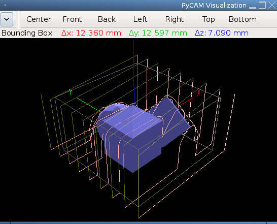
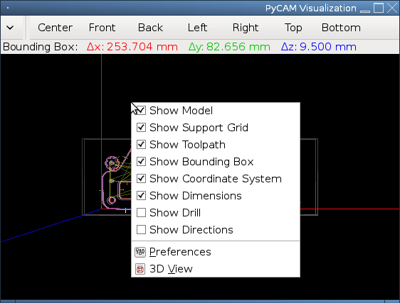
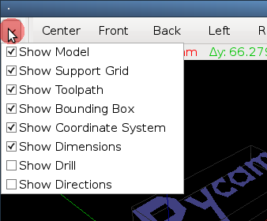

The 3D view window opens
automatically during PyCAM's startup. You can hide it via the usual
*close* icon of your window manager or by disabling the *3D View Window*
checkbx in the *Windows* menu.

The 3D view is based on OpenGL. Thus the respective libraries are
recommended. See the [list of dependencies](requirements.md) for
more details. You can use PyCAM even without OpenGL, but the lack of a
3D preview will probably hinder your workflow.

The OpenGL visualization is currently not highly efficient. Maybe you
will want to close the window temporarily while working on complex
models (eg. some 10k triangles).

Visual features
---------------

### Model

The 2D contour model or the solid 3D model is displayed. See the
*OpenGL* settings below for more configurable details.

### Support bridges

Support bridges are only visible if you
enabled this feature for your model.

### Toolpaths

By default only the most recently generated toolpath is visible. Open
the *Toolpaths* tab if you want to see previous toolpaths.

A toolpath consists of *cutting moves* and *safety moves*. The latter
are straight vertical moves up to safety height (see *GCode*
preferences) or horizontal moves at safety height. Safety moves are
drawn (by default) with a reduced opacity.

### Bounding box

The current bounding box is (by default) drawn as grey lines. You can
select other bounding boxes in the *Bounds* tab (directly) or in the
*Tasks* tab (indirectly).

### Coordinate system

The three axes of the coordinate system are drawn in red (x), green (y)
and blue (z). Hint: just remember *RGB*.

### Dimensions

The size of the current bounding is visible below the toolbar.

Additionally the stretch of the model along the three axes is displayed.

### Directions

The following directions can be visualized (optional - see
*Configuration* below):

-   toolpath direction
-   directions of 2D model contour lines
-   the normals of surface triangles (3D models only)

The directions of lines are visualized as cones placed in the middle of
each line.

The triangle's normals are shown as short lines starting in the center
of each triangle pointing in the normal's direction.

The winding state of each polygon is visualized via its transparency.
The outlines of holes are drawn half transparently. “Outside” polygons
use full opacity.

Configuration
-------------

### Visible items

All visible features of the 3D view can be selected in two different
locations:

-   the *Visible items* tab in the *Preferences* window
-   a drop-down list in the top left corner of the 3D view window (click
    at the small arrow icon)
-   the context menu of the 3D view area (click with the right mouse
    button)

### Colors

The colors of all visible items can be configured in the *Colors* tab of
the *Preferences* window. Reduce the opacity of specific items (e.g. for
toolpath safety moves) to highlight the importance of other items.

### OpenGL

There are some OpenGL properties available for configuration:

-   *Polygon fill*: draw solid triangles instead of wireframes (only for
    3D models)
-   *Lighting*: enable a directed source of light (instead of
    homogeneously distributed light
-   *Shadows*: enable the *shadow* effect (only useful with directed
    light)
-   *Perspective View*: switch between orthogonal and perspective view
    mode. The orthogonal view is useful for verifying the alignment of
    model features, but rotation, zooming and panning don't work
    perfectly. The perspective view is recommended instead.

Usage
-----

The 3D view can be rotated, zoomed and panned arbitrarily.

The small arrow at the top left corner of the window contains a
drop-down list of the currently enabled visualization features.

The 3D view area contains a context menu for visualization features and
for the *Preferences* window.

### View templates

The right part of the window's toolbar consists of seven view templates:

-   *Center*: the default angular view
-   *Front*: xz-plane looking at the positive y direction
-   *Back*: xz-plane looking at the negative y direction
-   *Left*: yz-plane looking at the positive x direction
-   *Right*: yz-plane looking at the negative x direction
-   *Top*: xy-plane looking at the negative z direction
-   *Bottom*: xy-plane looking at the positive z direction

### Mouse control

Drag the mouse while holding down one of these mouse buttons:

-   *Left button*: rotate the view. The rotation speed increases with
    the distance from the window's center.
-   *Right button*: zoom the view. Dragging the mouse to the right or up
    zooms in.
-   *Middle button*: pan the view.

The scroll wheel of your mouse allows the following operations
(mimicking [Inkscape's](http://inkscape.org) behaviour):

-   pan upwards: scroll up
-   pan downwards: scroll down
-   pan right: *SHIFT* + scroll up
-   pan left: *SHIFT* + scroll down
-   zoom in: *CTRL* + scroll up
-   zoom out: *CTRL* + scroll down

### Keyboard control

See the [list of shortcuts](keyboard-shortcuts#Visualization_window) for the
complete reference of keyboard controls.
