PyCAM uses the single-line fonts created by the
[QCAD](http://qcad.org)-developers.

See *Extras -&gt; Engrave Text* in the PyCAM menu.

Single-line fonts are usually more suitable for engraving than common
contour-based fonts. You will see the difference when you try to engrave
a regular font (e.g. created with [Inkscape](http://inkscape.org)). The
inner sections of each letter will be less blurry with a single-line
font (especially for small engravings).

The following list shows all fonts available in PyCAM. The example text
is:

    ABCDEFGHIJKLM
    NOPQRSTUVWXYZ
    01234567890
    !"$%&*()[]{}-_=
    +/#@~?<>,.;\|^

Font Samples
------------

| Name                         | Image                                           |
|------------------------------|-------------------------------------------------|
| Courier                      | 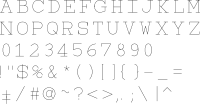               |
| Cursive                      | 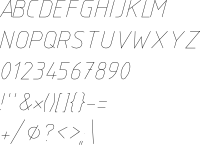               |
| Cyrillic II                  | 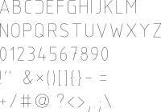             |
| Gothic German Triplex        | 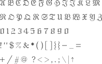         |
| Gothic Great Britain Triplex | 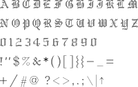        |
| Gothic Italian Triplex       | 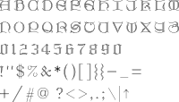        |
| Greek Complex                | 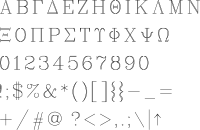         |
| Greek Complex Small          | 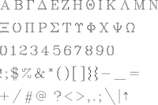   |
| Greek Outline                | 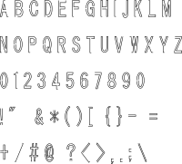              |
| Greek Outline+               |          |
| Greek Plain                  | 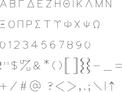           |
| Greek Simplex                | 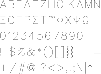         |
| ISO8859-11                   | 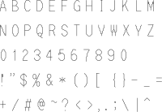            |
| Italian Complex              | 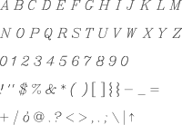       |
| Italian Complex Small        | 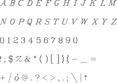 |
| Italian Triplex              | 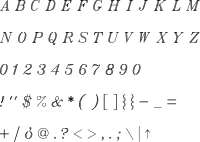       |
| Japanese                     | 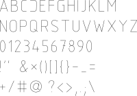              |
| Kochi Gothic                 | 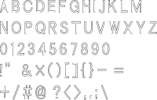          |
| Kochi Mincho                 | 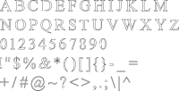          |
| Normal                       |                 |
| Normal Latin 1               | 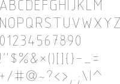         |
| Normal Latin 2               |          |
| Roman Complex                |          |
| Roman Complex Small          | 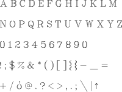   |
| Roman Duplex                 | 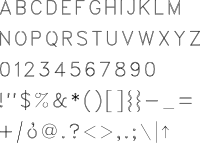          |
| Roman Plain                  |            |
| Roman Simplex                | 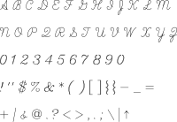         |
| Roman Triplex                | 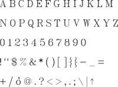         |
| Script Complex               | 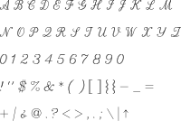        |
| Standard                     |               |
| Symbol                       | 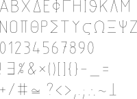                |
| Symbol Astro                 | 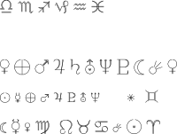          |
| Symbol Misc 1                | 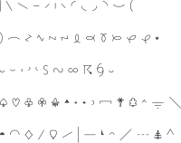         |
| Symbol Misc 2                | 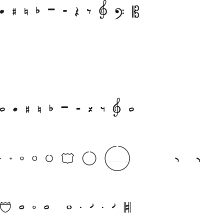         |
| Unicode                      |                |

