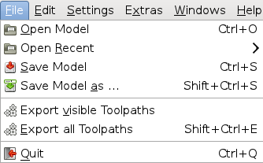
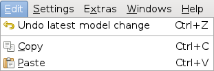
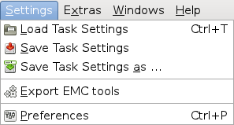
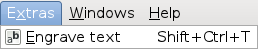
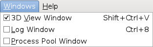
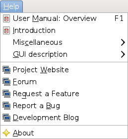

File menu
---------

**Open Model ...**   Choose a model file (STL / SVG / PS / DXF) via a dialog. The currently active model is replaced with the new one.

**Open Recent**   Choose a model file from the list of recently used ones (the list also contains files used by other applications).

**Save Model**   Save the currently active model to its original location. This item is disabled if the model was loaded from a remote location (e.g. via http) or it the file is not writeable. No confirmation is requested.

**Save Model as...**   Store the currently active model under a new filename. A file chooser dialog will pop up.

**Export visible toolpaths ...**   Store all currently visible toolpaths in a single GCode file. A file chooser dialog will pop up. The order of toolpaths is important. See the <em>Toolpaths</em> tab for the list of all generated toolpaths and for their <em>visible</em> state.

**Export all toolpaths ...**   Store _all_ generated toolpaths in a single GCode file. A file chooser dialog will pop up. The order of toolpaths is important. See the <em>Toolpaths</em> tab for the list of all generated toolpaths.

**Quit**   Request PyCAM to quit. This may take some seconds if you are connected to remote [processing servers](server-mode.md).

Edit menu
---------

**Undo latest model change** Reverse the latest operation that changed the model. This includes all transformations (scale, rotate, flip, swap, shift) as well as drastic changes (e.g. opening another model or 3D-to-2D projection). Changes regarding the tasks settings (e.g. cutter size) are ignored.

**Copy** Copy a representation of the current model to the clipboard. Other programs (e.g. Inkscape) can access the model data from the clipboard. 3D models are exported as STL data (ascii). 2D models are represented as plain SVG data.

**Paste** Read model data from the clipboard and replace the currently active model. 3D models are expected as STL (binary or ascii) or DXF data. 2D models can be transferred as SVG, PS or DXF files.

PyCAM announces and accepts the following target types via the
clipboard:

  Target type              | Data
  ------------------------ | ----------
  application/sla          | STL data
  application/postscript   | PS / EPS
  image/svg+xml            | SVG
  image/x-inkscape-svg     | SVG
  image/vnd.dxf            | DXF

Settings menu
-------------

Extras menu
-----------

Windows menu
------------

Help menu
---------

