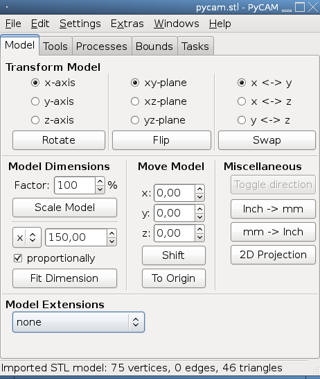

Model transformations
=====================

PyCAM can help you to prepare the model for the final processing.

Rotate, Mirror, Swap
--------------------

Operation | Description
--------  | -----------
**rotate** | rotate the model clockwise around a given axis
**flip**   | mirror the model against a given plane (xy, xz or yz)
**swap**   | exchange two axis of the coordinate system (e.g. exchange all x values with the corresponding y values)

Scale
-----

Operation | Description
--------  | -----------
**scale** | resize the complete model proportionally with a given factor via an input control (as a percent value). An input of 200% doubles the size of the model. The location center of the model will be preserved.
**fit dimension** | scale one axis to a given value (e.g. if the unit size of your modeling software is not metric). By default all axes are scaled proportionally. This can be changed via the corresponding checkbox.

Move
----

Operation | Description
--------  | -----------
**move to origin** | afterwards the model should start at the center of the coordinate system pointing along the posive values of the three axes.
**shift** | move the model along the three axes by the distances given in the three separate input controls. Negative or zero values are allowed.

Miscellaneous
-------------

Buttons referring to 2D operations are not visible if a 3D model is
currently loaded (and vice versa).

Operation | Description
--------  | -----------
**Toggle direction** | reverse the direction of all lines of a 2D model
**Revise direction** | First try to merge open polygons regardless of their directions. Secondly analyse the inside/outside relationships of all closed polygons in a 2D model. The direction of polygons with an unsuitable winding state is reversed. This usually fixes inconsistent winding combinations created by DXF/SVG export programs.
**Extrude** | add a third dimension to a 2D model. The following parameters of the slope of the edges are configurable: shape, precision, height and width. ([Read more](http://fab.senselab.org/node/227))
**2D Projection** | cut a 3D model at z=0. The resulting contour polygons define the new 2D model. The contour of the bottom of the model is used if the model is completely above or below z=0.
**Inch → mm** | scale the model by the factor 25.4
**mm → Inch** | scale the model size down with the divider 25.4
