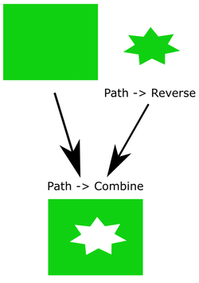
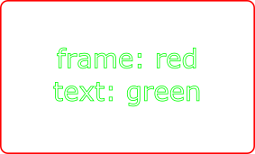
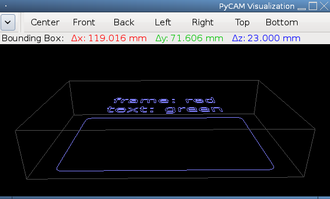
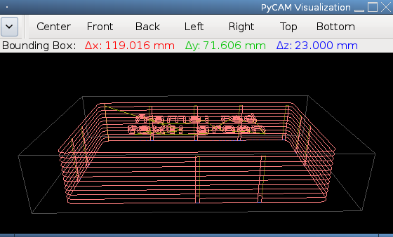

Overview
--------

[Inkscape](http://inkscape.org) is a vector graphics editor suitable for
designing 2D models. Please read the following hints carefully before
trying to create a 2D model with Inkscape, since this process could
otherwise fail in non-obvious ways ...

Importing SVG files require external programs. Read PyCAM's
[requirements](requirements#Optional_external_programs) for
details

Export file format
------------------

Always save your Inkscape drawings in the *Scalable Vector Graphics*
(SVG) or *PostScript* (PS/EPS) file format.

Don't save to DXF files - PyCAM will not be able to import them
properly.

Restrictions
------------

Read the following hints carefully - otherwise your objects can't be
imported by PyCAM:

-   convert all objects to *Paths*
    -   *text* elements don't need to be turned into *Paths*
-   *Fill and Stroke*:
    -   closed polygons: use *Fill*; try to avoid *Stroke*, since it
        would mess up your object dimensions
    -   line segments: use *Stroke* (no *Fill*) combined with the *Butt*
        cap style - otherwise the lengths of the line segments are not
        properly visualized
-   opacity of all Paths **must** be at 100% (see *opacity* in the *Fill
    and Stroke* properties dialog)
-   items outside of the page sheet are ignored (specify the size of the
    sheet via *Document Properties* in Inkscape)

Colors
------

PyCAM's import uses the color of an object as an indication of its
height. You need to stick to a single color (e.g. black) if you want to
create a single-plane 2D model. See [Pseudo 3D support](#Pseudo_3D_support)
below for more details.

Outlines and holes
------------------

The following hints are only necessary, if you need an SVG with
consistent winding states. Alternatively you can repair inconsistent
winding states with the *Revise directions* button in the *Model* tab of
PyCAM. This button is only visible if you are currently working with a
2D model.

The direction of a path can be changed via the *Reverse* item in the
*Path* menu of Inkscape.

Visualizing path directions in Inkscape is currently (v0.47) not easy.

Use the following approach, if you need to work with holes and outlines:

-   create all paths
-   remove contours; define filling
-   reverse all inner paths (holes): see menu *Path -&gt; Reverse*
-   move the inner paths to their final positions inside of the outline
    paths
-   select all holes and outlines of a single object
-   choose *Path -&gt; Combine* (CTRL-K) to combine these paths
-   the holes (due to their reversed direction) are now drawn in white

Beware: the other *Path* operations (*union*, *difference*,
*intersection*, ...) are not recommended, since they will obscure the
directions of the paths. Thus you will run into problems when opening
these models with PyCAM later. Just use *combine* whenever you can.

Fonts
-----

Text is automatically converted to a path when loading an SVG file with
PyCAM. You don't need to care about embedding fonts.

Beware: TrueType fonts (used by Inkscape) are *outline* fonts. Thus
every glyph is described by its outline and inner holes. Alternatively
you may want to use the [single-line fonts](engrave-fonts.md)
supplied with PyCAM.

Pseudo 3D support
-----------------

### Height by layer (since v0.7)

You can create 2D shapes at different heights (z-levels) by using
multiple layers in your SVG document (e.g. via inkscape).

When loading an SVG file with multiple layers, the height gap between
each two layers is one unit (e.g. mm). This distance can be easily
scaled within PyCAM to an arbitrary height. This allows a precise
height adjustment as long as only two layers are involved.

If more than two layers with specific height requirements
are required, then you need to add empty layers between these in
order to achieve the wanted height gap between the objects.

### Height derived from color (up to v0.6.x)

You can create 2D shapes at different heights (z-levels) by using
different colors. Thus you should use only a single color if all your 2D
shapes should be in the same plane.

The mapping from color to height is defined by the conversion program
*pstoedit* (it is used by PyCAM when importing an SVG file). The
conversion works as follows:

-   look for the nearest color int the DXF color table (256 colors)
-   divide the index of this color within the table (0..255) by 255
-   the resulting value (between 0 and 1) is used as the height of the
    object/path

This complicated color-to-height conversion sadly makes it impossible to
position objects precisely. Additionally the DXF color palette is not
biunique, e.g. it contains multiple occurrences of the color green
(\#00FF00) - thus green will always be mapped to the height of its first
occourence in the table.

Anyway: if you feel the need to use multiple colors for vertical
placement of 2D shapes in PyCAM, then you need to decide between *Two
vertical levels* and *Multiple vertical levels*. Read more details
below.

### Two vertical levels

This procedure requires you to only use two different height levels for
all your 2D shapes.

1.  Choose stroke color (A) or (B) for all your objects. The lower
    objects should use red. The upper objects should use another (always
    the same!) color (e.g. black).
2.  Save the document as an SVG file and open it with PyCAM.
3.  The 2D model has a height &gt; 0. All red items are placed on the
    bottom level. All black items are placed at the ceiling.
4.  Use the *Fit Dimension* button (part of the *Model* tab) to scale
    the z dimension of your model. You should disable *proportional*
    scaling here.
5.  The red and black 2D objects now have a defined distance (according
    to the specified z-axis dimension above).

### Multiple vertical levels

Please be aware that it is hard to place objects accurately at multiple
levels with the color/height mapping described above. So please use the
following procedure with care and check the result carefully.

1.  Import the DXF color palette to Inkscape.
    1.  The DXF color palette file can be downloaded
        [here](http://pycam.svn.sourceforge.net/viewvc/pycam/trunk/share/misc/DXF.gpl).
        Save it as *DXF.gpl*.
    2.  Move this file to the *palettes* directory of your Inkscape
        installation. Read the
        [description](http://tavmjong.free.fr/INKSCAPE/MANUAL/html/Customize-Files.html)
        of user-specific and system-wide locations.
2.  Start *Inkscape*.
3.  Select the new color palette *DXF* (click at the small arrow to the
    right of the color chooser located at the bottom of the Inkscape
    window).
4.  Create 2D shapes (see above for details and restrictions) and assign
    different colors picked from the current palette (don't create
    custom colors!).
5.  The order of the colors taken from the color palette determines the
    relative height of each object. You need to avoid colors that occur
    multiple times in the palette (e.g. green).
6.  Open the SVG file in PyCAM and scale the z axis of the model.
    Hopefully the relative vertical distances of your 2D shapes suit
    your needs.

Note on using **black**: the color *black* is the first color of the DXF
palette. *pstoedit* handles the first color of the palette differently
and thus ignores it. So be prepared that the color *black* will be
mapped to color \#242 (a gray color near the end of the DXF color
palette). Thus black objects/paths are usually near the top of the model
in PyCAM.
