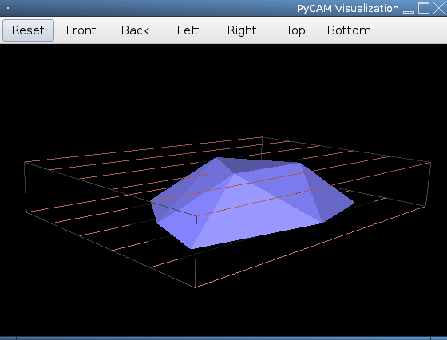
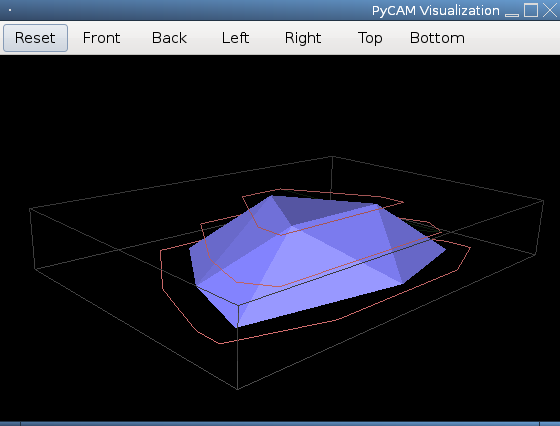
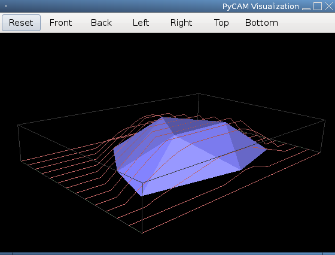
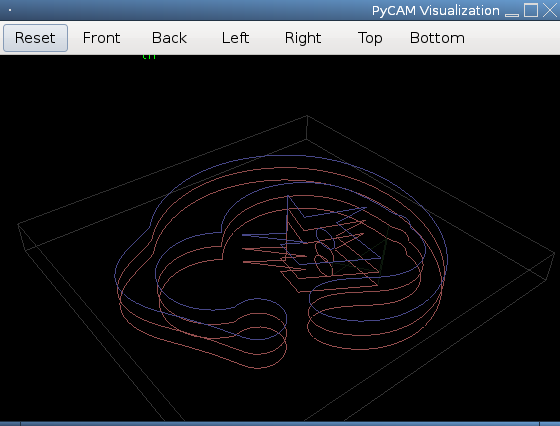

Process settings
================

A process can have different properties. Most importantly you need to
decide for a strategy and later for more fine-grained details like
post-processing, directions or specific parameters.

Strategies
----------

### Slice removal

Remove slices of material around the model. This strategy is useful for
roughly cleaning the material if it is deeper than the maximum
penetration depth of your current tool. The *Step Down* value specifies
the maximum height of each layer.

### Waterline/Contour (polygon)

This contour strategy is based on detecting collisions in a fixed grid
and connecting these points of collision. You should use a high
*Overlap* value to increase accuracy.

The algorithm does not work under certain circumstances, e.g. if the
bounding box does not cover the complete model. You should probably use
the newer contour strategy below.

### Contour (follow)

This contour strategy is based on the waterlines of the model's
triangles at the given height. It should be perfectly accurate, but it
requires more processing time.

The contour-&gt;follow strategy is quite new (v0.4) and thus should be
considered experimental.

This strategy is not (yet) available from the GUI.

### Surfacing

The surface strategy follows the shape of the model by calculating the
lowest possible location of the tool at each position of a fixed grid.
Use the *Overlap* value to adjust the distance between adjacent lines.
You should probably use the *slice removal* strategy before - otherwise
you risk to break the tool for deep models.

### Engraving

Engraving is the only available toolpath strategy for 2D models (e.g.
taken from a SVG or DXF file). Adjust the upper limit of the bounding
box to specify the final depth of the tool movements. The *Step Down*
value specifies the maximum height of each layer.

Use the *Engraving offset* setting if you want the cutting tool to move
slightly next to the given contour. This is especially useful if you
want to cut pieces out of the material. Here you should use the tool
radius (not diameter) too keep the original size of the pieces. A
negative offset shifts the path of the tool towards the inside of the
model.

Path Direction
--------------

Specify if the toolpath lines should move along the X or the Y axis.

Milling style
-------------

### Conventional / up

In conventional milling style the cutter (rotating clockwise) moves with
the material on its left side. Thus the force applied to tool is quite
constant. The resulting quality of the cut is as good as for the *climb*
style. This should be mainly used for older machines or hard material.

### Climb / down

In climb milling style the cutter (rotating clockwise) moves with the
material on its right side. Thus the force applied to the tool rises
quickly when the edge of the tool cuts into the material (with every
rotation). The resulting quality is slightly better than with
conventional cutting. A mill with backlash elimination is recommended.

### Ignore

Choose the default *Ignore* if the milling style is not important for
you. This optimizes the machining time by reducing moves at safety
height.

Parameters
----------

### Overlap \[%\]

This defines the relative overlap of two adjacent toolpaths. Higher
values increase the machining time. Lower values decrease the surface
quality.

The example values below are absolute values. Combined with your tool
diameter you can calculate the corresponding relative overlap.

### Material allowance

Minimum requested distance between the tool and the material.

You should use this setting when using bigger tools that tend to be less
precise. This avoids unintentional damages of the surface.

The last process should never have a material allowance greater than
zero.

### Maximum step down

Maximum height of a layer for *PushCutter* or *Engraving* strategies.

This value depends on the material hardness, tool size, the feedrate and
(partly) on the overlap.

Some examples (please add your experiences here):

  Step down   | Material  | Tool diameter
  ----------- | ----------| -------------
  4mm         | spruce    | 1mm
  8mm         | spruce    | 3mm

### Engraving offset

Move the engraving cut by a certain distance away from the model's
contour. This can be used to compensate the tool radius, that would be
abrased from the material when moving along the contour.

Common values:

- **zero:** move the center of the tool along the given contour
- **half of the tool diameter:** move the tool around the given contour
- **negative value:** move the tool inside of the given contour

### Pocketing

Only basic pocketing support is currently available.

Select the *Engraving* toolpath strategy if you want to use pocketing.

The following three options are available:

- **none:** no pocketing
- **holes:** fill areas surrounded by an inner polygon (counter-clockwise direction)
- **enclosed:** fill areas surrounded by an outer polygon (clockweise direction)

The following conditions must be fulfilled for any pocketed area:

-   the area is completely surrounded by a convex polyon
-   there are no other objects (lines, polygons) partly or completely
    inside of the surrounding polygon

Pocketing is done with 20% overlap (not configurable).

### Safety height

The safety height is the absolute z-level that is considered to be safe
for rapid movements. This should be clearly above the highest point of
your model.

This parameter is set after generating the toolpath, and can be found for each 
toolpath under Settings/Preferences.
