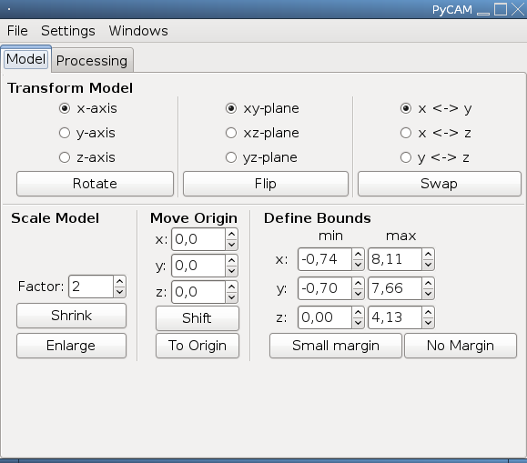
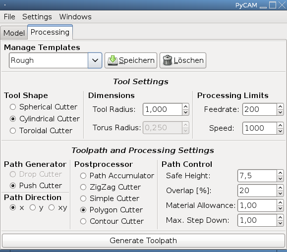
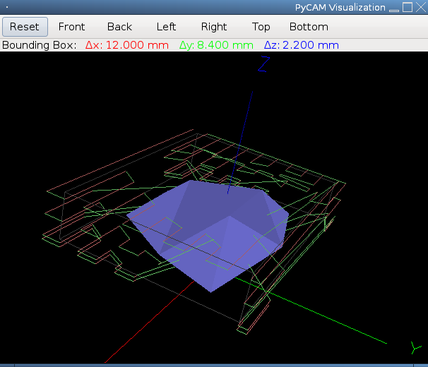
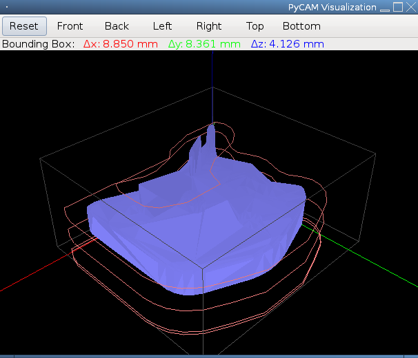
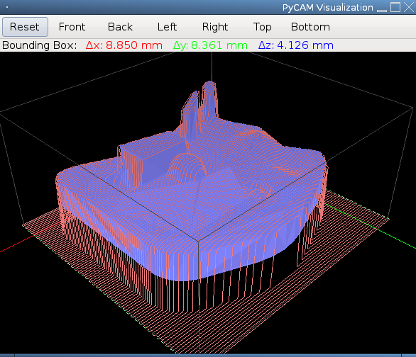
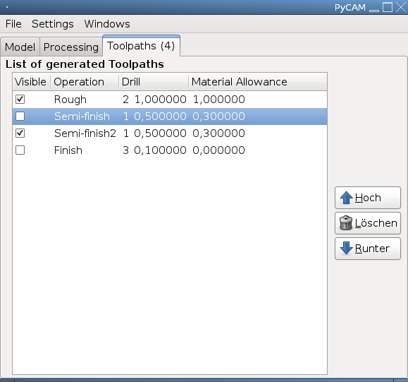
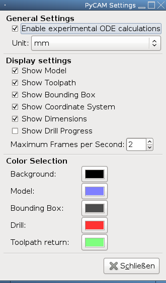
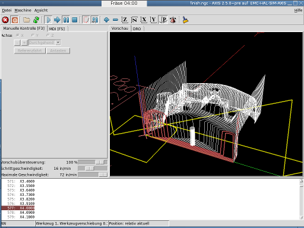

Screenshots
===========

Startup Screen
--------------

Model operations
----------------

Processing settings
-------------------

Roughing Operation
------------------

Semi-finishing Operation
------------------------

Finishing Operation
-------------------

Toolpath management
-------------------

Settings
--------

Importing the GCode in LinuxCNC
---------------------------

