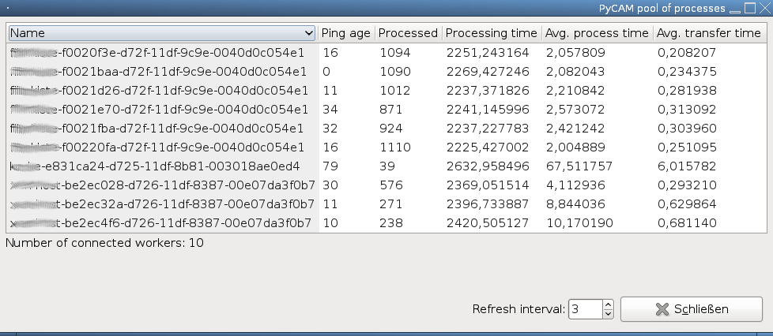
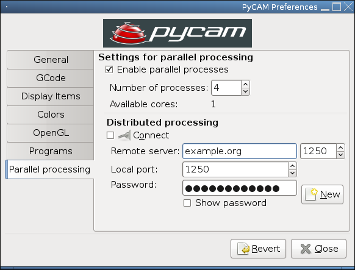
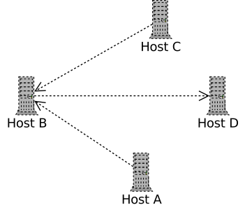

PyCAM server mode
=================

PyCAM supports the distribution of its calculations among multiple
different hosts. This can speed up processing especially for big models.

Overview
--------

Basically there are two different modes of operation:

-   local mode: the toolpath generation will be done on your computer -
    no service is offered to other hosts. This is the default.
-   server mode: your computer creates (or joins) a pool of hosts. Each
    host can submit calculation requests to the pool. The calculation of
    these requests is distributed among all available hosts in the pool.
    Thus every host in the pool offers computational resources and - at
    the same time - can use the resources of all other hosts.

Technical details
-----------------

The following graph shows four hosts (A..D) belonging to one pool of PyCAM servers.
Below you find the specific commands used for starting these hosts:

-   Host D: `pycam --enable-server --server-auth-key MY_SECRET_KEY`
-   Host B: `pycam --enable-server --server-auth-key MY_SECRET_KEY --remote-server HOST_D`
-   Host C: `pycam --enable-server --server-auth-key MY_SECRET_KEY --remote-server HOST_B`
-   Host A: `pycam --enable-server --server-auth-key MY_SECRET_KEY --remote-server HOST_B`

As you can see above, there is no specific network topology required.
Thus you can organize your connections according to your preference:

-   connect the hosts in a linear chain
-   create a star topology with a central host (every other host
    connects to it)
-   create a mixed topology (hosts connecting to each other in an
    arbitrary structure - see the example above)

Requirements
------------

You need to fulfill the following requirements when running a server
pool:

-   all hosts should run a similar version of PyCAM (there is no stable
    API, yet)
-   all hosts share the same secret password (see *--server-auth-key*
    above)
-   port 1250 must be open for all hosts, that are the target of
    *--remote-server* connections from other hosts
-   **IMPORTANT WARNING**: any member of the pool can inject malicious
    code, that will be executed by the other hosts locally. Thus you
    need to fully trust all members of the pool.

Open issues
-----------

-   server mode is not available with the standalone Windows binary (the
    installer package works)
-   a host in server mode will need between 5 and 30 seconds to quit
    (after closing the window, pressing CTRL-Q, ...)

BIG FAT WARNING
---------------

Any member of the pool can inject malicious code into the pool. That
means that you give full user permissions to all other members of the
pool:

-   never ever think about running PyCAM in server mode as *root* or
    with administrative permissions (yes, that's for most Windows user
    out there ...)
-   reduce the permissions of the user as far as possible (no write
    access to the filesystem, only network access allowed)
-   run PyCAM in a sandbox (e.g. a *chroot* environment or a virtualized
    system)
-   always use a good shared secret for your pool (see
    *--server-auth-key*)
    -   the secret is transmitted in plain text over the network - thus
        you should better run it through a VPN or tunnel the connection
        through SSH
