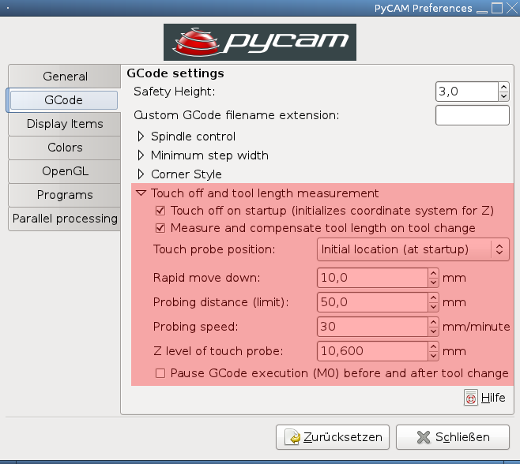
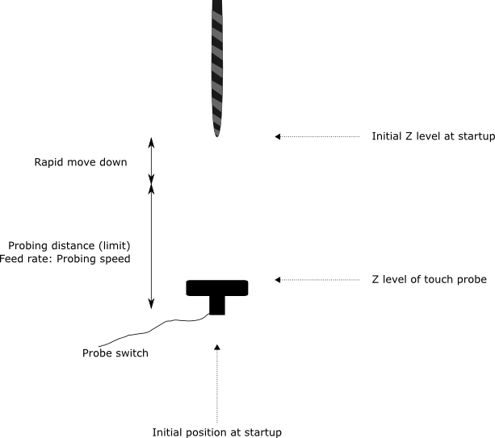

Overview
--------

Before milling an object you always need to adjust the coordinate system
of your machine controller (e.g. [LinuxCNC](http://www.linuxcnc.org/)). This
operation is quite easy for the planar axes x and y. Only z is a bit
tricky, since it usually needs to be quite accurate. Otherwise you risk
to mill slightly too deep (damaging the base of the milling machine) or
slightly too high (the cut through the object is not complete).

Touch off is the initial adjustment of the z axis by measuring the
height of the lowest point of the milling tool.

Tool change is the process of switching from one tool to another. Manual
tool change involves a length compensation: adjusting the coordinate
system of the machine controller according to the length of the new
tool. Usually this is accomplished by shifting the coordinate system by
the difference between the height of the old tool and the new tool.

**Beware:** the generated GCode probably only works with LinuxCNC. Please
check carefully (and slowly) if it works for your machine controller, as
well. Any feedback (just edit this page) is highly appreciated!

Touch off on startup
--------------------

The following description is only valid if the *Touch probe position*
value is *Initial location*. The *Fixed location (absolute)* setting
follows a similar pattern.

The *touch off on startup* procedure follows these steps:

1.  position the tool above the probe switch
    1.  the vertical distance between the tool and the switch must
        clearly exceed the *Rapid move down* value
    2.  the vertical distance between the tool and the switch may not
        exceed the sum of *Rapid move down* and *Probing distance*
2.  run the GCode program

The GCode will tell the machine controller to do the following:

1.  store the initial position of the machine as the touch off position
2.  move down rapidly: the distance is specified via *Rapid move down*
3.  move down slowly and wait for the probe switch to close (the maximum
    way down is defined by *Probing distance*)
4.  shift the z axis of the coordinate system in such a way, that the z
    level of the touch off location is equal to the value specified by
    *Z level of touch probe*
5.  rapidly move up to the initial location
6.  optional pause (M0) of GCode execution (should be enabled if your
    spindle is controlled manually)
7.  start execution of the first toolpath

The spindle will start after the touch off (via M3).

Tool change
-----------

A tool change occurs between two toolpaths using different tools.

The tool change operation follows these steps:

1.  optional pause of GCode execution (should be enabled if your spindle
    is controlled manually)
2.  stop spindle (M5)
3.  move to touch off position (*initial location (on startup)* or
    *fixed location (absolute)*)
4.  move down rapidly: the distance is specified via *Rapid move down*
5.  move down slowly and wait for the probe switch to close (the maximum
    way down is defined by *Probing distance*)
6.  remember the height of the current tool
7.  rapidly move up to the touch off location
8.  request tool change (Tx M6)
    1.  your machine controller will wait for confirmation
9.  repeat the rapid and slow move down with the new tool
10. adjust the z axis of the coordinate system by the difference between
    the height of the new tool and the height of the old tool
    1.  this compensates the change of the tool's length
11. rapidly move up to the touch off position
12. optional pause of GCode execution
13. start spindle (M3)
14. continue with the next toolpath
