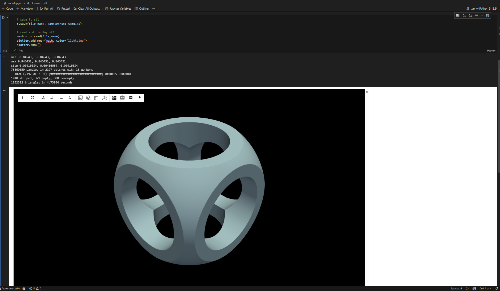

# Visual Studio CAD

It is possible to use Visual Studio Code as a primitive CAD program, where you can quickly iterate on an STL and visualize it in 3D right in the editor. 

## Setup

1. (Recommended) create a virtual environment using the virtual environment manager of your choice
   - `python3 -m venv .venv`
2. Install the required python packages
   - `pip install -r requirements.txt`
3. Install the required Visual Studio Code Extensions found in `.vscode/extensions.json`
4. Open [`vscad.ipynb`](./vscad.ipynb)
5. Select the appropriate python environment as your kernel
6. Run the file!

## Recommendations

- Turn the samples down a few orders of magnitude when prototyping to go faster, then back up for the final output
- Resize the pv output window to something suitable for your monitor
- Make sure to move the file or change the name when you're done with a part so you don't overwrite it when you go to start the next one!

